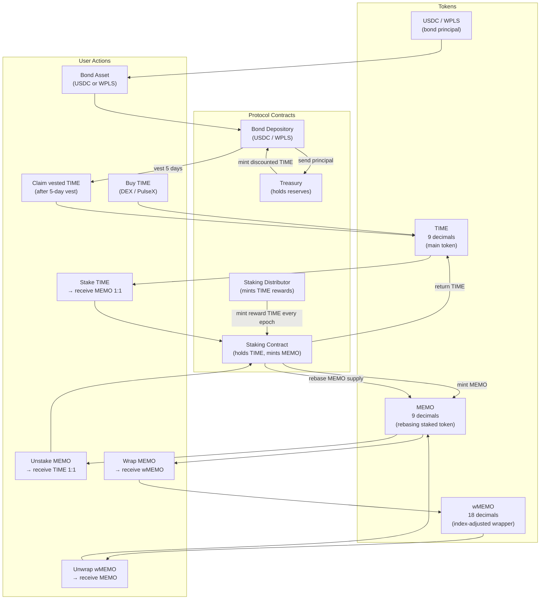
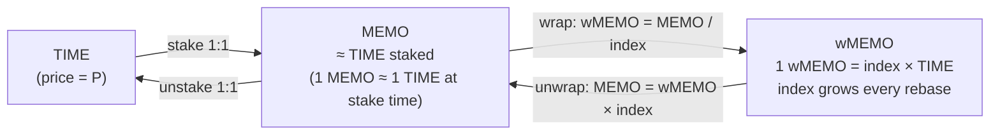
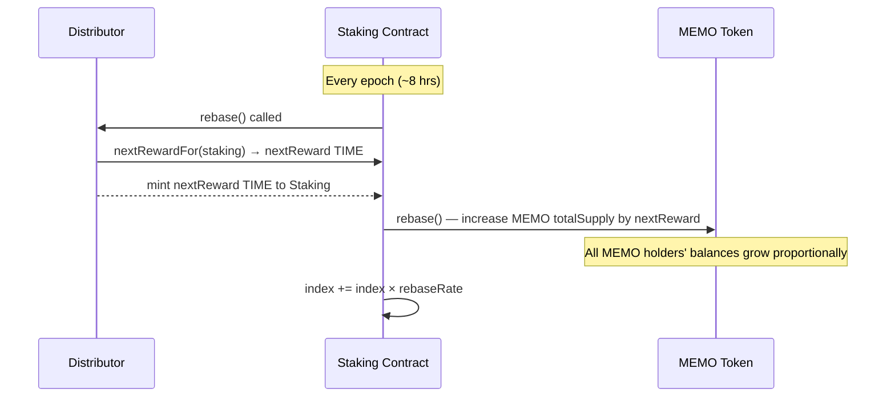
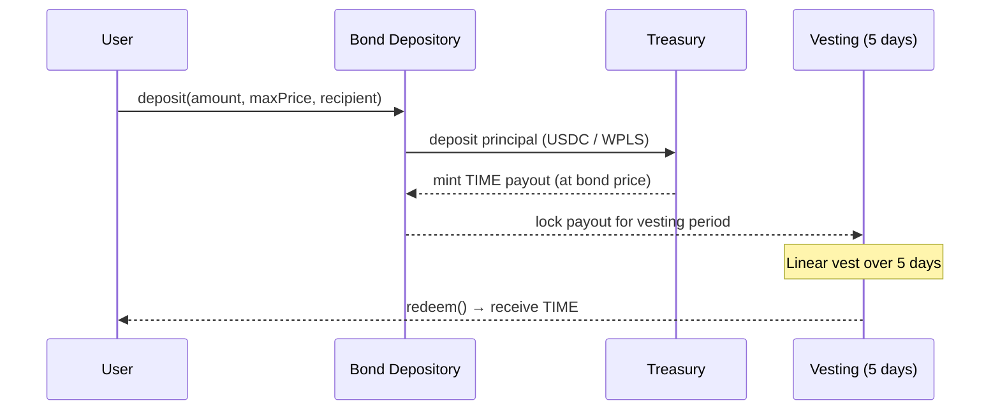

# Wonderland Protocol — Diagram & Metric Formulas

## Token Lifecycle



---

## Token Relationship



---

## Rebase / Epoch Cycle



---

## Bonding Flow



---

## Dashboard Metric Formulas

| Metric | Formula | Source |
|--------|---------|--------|
| **TIME Price** | `USDC reserve / TIME reserve` (from DEX LP) | `LpPair.getReserves()` |
| **wMEMO Price** | `timePrice × index` | `timePrice × staking.index()` |
| **Market Cap** | `wMEMO supply × wMEMO price`<br>*(or `MEMO supply × timePrice` when no wMEMO minted)* | `wMEMO.totalSupply() × wMemoPrice` |
| **TVL (Staking)** | `wMEMO circulation × wMEMO price`<br>*(or `MEMO circulating supply × timePrice` when no wMEMO minted)* | `wMEMO.totalSupply() × wMemoPrice` |
| **Treasury Balance** | `totalReserves / 1e9` | `treasury.totalReserves()` |
| **Backing per wMEMO** | `Treasury Balance (USD) / wMEMO circulation` | `total / effectiveWMemoCirc` |
| **Staking APY** | `(1 + rebaseRate)^(365 × 3) − 1` | rebases are 3×/day |
| **5-Day Rate** | `(1 + rebaseRate)^(5 × 3) − 1` | |
| **Rebase Rate** | `distributor.nextRewardFor(staking) / TIME.totalSupply()` | protocol-level rate |
| **Current Index** | `staking.index() / 1e9` | grows every rebase |
| **Bond Price** | `bondDepository.bondPriceInUSD()` | scaled to reserve decimals |
| **Bond Discount** | `(timePrice − bondPrice) / bondPrice` | negative = premium |
| **Bond ROI** | same as discount | |

---

## wMEMO: When Is It Minted?

wMEMO is **not** minted automatically. The user must explicitly wrap:

```
TIME  →  stake (Staking Contract)  →  MEMO
MEMO  →  wrap  (wMEMO Contract)    →  wMEMO
```

- **Mint:** User calls `wMEMO.wrap(memoAmount)` — MEMO is transferred to the wMEMO contract and wMEMO is minted at `wMEMO = MEMO / index`.
- **Burn:** User calls `wMEMO.unwrap(wMemoAmount)` — wMEMO is burned and MEMO is returned at `MEMO = wMEMO × index`.

Since the index grows with every rebase, holding wMEMO is equivalent to holding rebasing MEMO — you always unwrap into *more* MEMO than you wrapped.

> **Testnet note:** Until at least one user wraps MEMO into wMEMO, `wMEMO.totalSupply() = 0`. The UI falls back to MEMO-equivalent values (`MEMO.circulatingSupply() / index`) so that Market Cap, TVL, and Backing per wMEMO display correctly even before any wrapping has occurred.

---

## Index Growth Over Time

```
index_0  = 1.000  (genesis)
index_1  = index_0 × (1 + rebaseRate)
index_n  = (1 + rebaseRate)^n

rebaseRate ≈ 0.5% per rebase (3× daily → ~23,000% APY)
```

A user who wraps `100 MEMO` at `index = 1.0` holds `100 wMEMO`.  
After 1 year at 0.5% / rebase, `index ≈ 17.5`.  
Unwrapping returns `100 × 17.5 = 1,750 MEMO` — a 17.5× increase.
